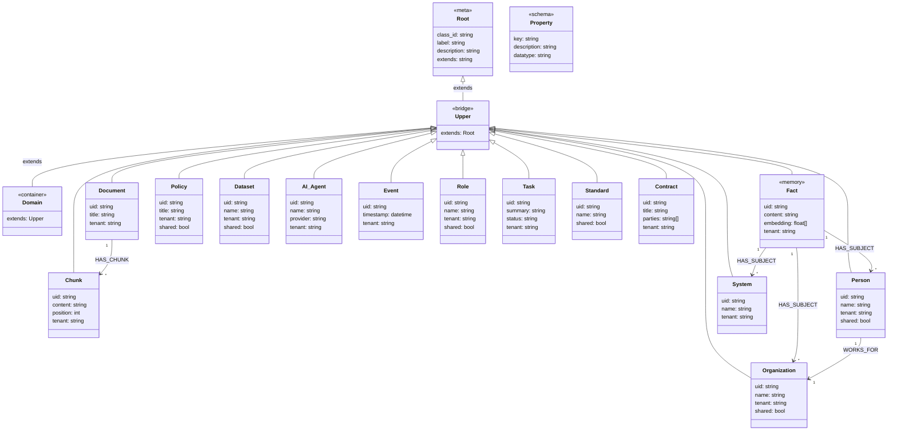

# neo-mem

**Neo4j-backed GraphRAG memory for AI agents.**

A persistent memory backend that stores conversational facts in a Neo4j
knowledge graph with vector embeddings, enabling semantic recall across
sessions. Works with any AI agent (Hermes, Claude Code, Codex, custom
agents) via a plugin or MCP server.

## Why

LLM context windows are ephemeral. neo-mem gives your agent a *long-term
memory*: every conversation turn is stored as a fact node with an embedding,
and before each turn the agent automatically recalls the most relevant
past memories — semantic search over everything you've ever discussed.

## Features

- **Graph memory** — facts stored as Neo4j nodes, recallable by cosine
  similarity and traversable as a graph.
- **Configurable embeddings** — local Ollama by default (free, uses your
  GPU); switch to OpenAI / OpenRouter / any OpenAI-compatible API with one
  env var.
- **Agent-agnostic** — ships as a Hermes plugin *and* a standalone MCP
  server (Works with Claude Code, Codex, and any MCP client).
- **One-command setup** — `docker compose up` brings up Neo4j with the
  vector index pre-configured.
- **Example ontology** — seed data demonstrating the class hierarchy,
  properties, multi-tenancy model, and memory structure
  (`examples/ontology/seed.cypher`).

## Ontology

neo-mem ships with a minimal example ontology that demonstrates the
class hierarchy, multi-tenancy model, and memory structure. Below is
the conceptual class diagram:



### Multi-tenancy model

Nodes carry a `tenant` string to isolate data per user. Shared reference
data (standards, regulations, ontology schema) omits the tenant field or
sets `shared: true`:

| Scope | Example | `tenant` | `shared` |
|---|---|---|---|
| User-specific facts | `Fact`, `Task`, `Chunk` | `"tenant-a"` / `"tenant-b"` | — |
| User-specific entities | `Person`, `System` | `"tenant-a"` / `"tenant-b"` | — |
| Shared entities | `Organization`, `Standard` | — | `true` |
| Schema | `OntologyClass`, `Property` | — | — |

### Query pattern

```cypher
-- Recall only this tenant's memories
MATCH (f:Fact)
WHERE f.tenant = $tenant
CALL db.index.vector.queryNodes('fact_embedding_index', 5, $query_vector)
YIELD node, score
WHERE node.tenant = $tenant
RETURN node.content AS memory, score
```

## Quick start

### 1. Start Neo4j

```bash
cp .env.example .env   # edit NEO4J_PASSWORD
docker compose up -d
```

### 2. Install the plugin (Hermes)

Copy `plugin/` into your agent's plugins directory and set the env vars
from `.env.example`. See `plugin/README.md`.

### 3. Or use the MCP server (any agent)

```bash
pip install mcp-neo4j-cypher
# configure per mcp/README.md
```

## Configuration

All settings are environment variables (see `.env.example`):

| Variable | Default | Purpose |
|---|---|---|
| `NEO4J_URI` | `bolt://localhost:7687` | Neo4j Bolt endpoint |
| `NEO4J_USER` | `neo4j` | Neo4j username |
| `NEO4J_PASS` | — | Neo4j password |
| `EMBEDDING_PROVIDER` | `ollama` | `ollama` or `openai` (OpenAI-compatible) |
| `EMBEDDING_MODEL` | `nomic-embed-text` | Embedding model name |
| `EMBEDDING_BASE_URL` | `http://localhost:11434/v1` | Embedding API endpoint |
| `EMBEDDING_API_KEY` | `ollama` | API key (any non-empty value for Ollama) |
| `NEO4J_EMBEDDING_DIMENSION` | `768` | Vector index dimension |

## License

Apache 2.0 — see [LICENSE](LICENSE) and [NOTICE](NOTICE) for details.

## Acknowledgments

This project was developed with the assistance of **DeepSeek**, **Perplexity**,
and **GitHub Copilot**. See [NOTICE](NOTICE) for full acknowledgments.
